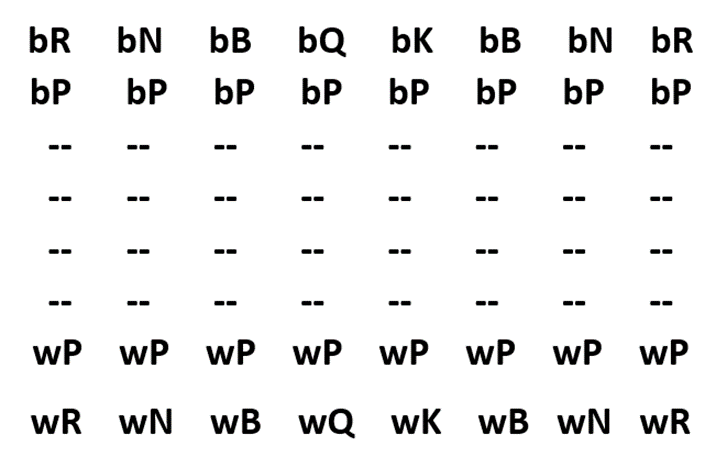
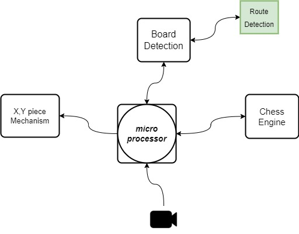

# **Automated Chess**
Intended idea is to make an automated chess board where an AI algorithm could move pieces by itself on a physical chess board. It will have the ability to perform attacks and defenses against its opponent

---
## P.E.A.S.

**Performance measure**

+ **Algorithm Complexity**
   
  + Chess Engine(Game State) 
      - Generate Valid Moves
      - King Check, CheckMate, StaleMate

  + AI Alogrithm Complexity
    - MinMax, Alpha Beta

**Environment**

- Physical Chess Board

**Actuator**

- X, Y Mechanism (Physical Pieces Movement)

**Sensor**

- Camera (Computer Vision Input)

---
## O.D.E.S.A

**Observability** = (fully or Partial) observable

- Fully

**Deterministic** = deterministic , stochastic, strategic

- Strategic

**Episode** = Episode , sequential

- Sequential

**Static** = static ,dynamic , semi-dynamic

- Semi-Dynamic

**Agent** = Single agent , multi-agent

- Multi-agent

---
## Type of agent

- **Goal based reflex agent**

---
## **Game State Matrix**

The Game is played on this matrix where:

### **Color:**
+ w : white | b : black
### **Pieces:**
+ P : Pawns
+ R : Rook
+ N : Knight
+ B : Bishop
+ Q : Queen
+ K : King

---
## **System Architecture**

### Diagram Layout:

### **Main Components**:
+ X, Y Movement Mechanism (Mechanical)
+ Chess Board Detection (Software)
  - Route Detection (Not Colliding With Other Pieces)
+ Chess Engine < **Game State** > (Software)

----
# Licence
GPL3
